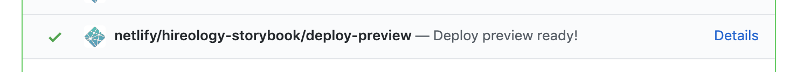

<p align="center">
  <a href="https://hireology.com/" target="_blank" rel="noopener noreferrer">
    
  </a>
</p>

[](https://travis-ci.org/Hireology/molecules)

# Molecules

Hireology's component library

## Installation

Molecules is available as an npm package.

```bash
npm i @hireology/molecules --save
```

or if you prefer Yarn

```bash
yarn add @hireology/molecules
```

## Usage

```js
import { Button } from '@hireology/molecules';
import '@hireology/molecules/dist/molecules.css';

ReactDOM.render(<Button>Button</Button>, mountNode);
```

NOTE: molecules assumes you already have Font Awesome available in your project

### Documentation

To view the components and their, visit our [storybook][storybook-prod].

## Development

Develop locally with [Storybook][storybook]:

```bash
$ git clone git@github.com:Hireology/molecules.git
$ cd molecules
$ npm install
$ npm run storybook
```

Each commit to `dev` will automatically deploy storybook.

You can view a preview of the deploy in your PR by clicking the details button in this build step:

<div align="center">
  
</div>

### Testing
Run tests locally: `npm run test`  
Run test coverage: `npm run test-coverage`  

### Expected Component Directory Structure
When you add a new component, it should follow the below directory structure:
```
/NewComponent
  index.js                 - export default from NewComponent.jsx
  NewComponent.jsx         - component code
  NewComponent-test.jsx    - test file
  newComponent.scss        - stylesheet
  newComponent.stories.jsx - storybook configuration
```

[storybook]:https://storybook.js.org/
[storybook-prod]:https://hireology-storybook.netlify.com
